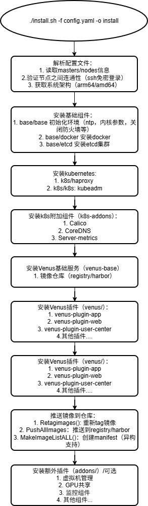

# Venus Install Tools 项目学习指南

## 一、项目概述

**venus-install-tools** 是一个自动化部署工具，用于在 Linux 服务器集群上部署 **Kubernetes** 和 **Venus 云管理平台**。

### 1.1 核心功能
- 自动化安装 Kubernetes 集群
- 部署 Venus 云管理平台组件
- 支持异构架构（amd64/arm64）
- 支持单节点和多节点集群部署
- 提供升级、卸载和维护能力

### 1.2 技术栈
| 技术 | 用途 |
|------|------|
| Bash Shell | 核心安装脚本 |
| Kubernetes | 容器编排平台 |
| Docker | 容器运行时 |
| etcd | 分布式键值存储 |
| yq | YAML 解析工具 |
| HAProxy | 负载均衡器 |
| Calico | 网络插件 |

---

## 二、目录结构详解

```
venus-install-tools/
├── addons/                 # 额外插件（虚拟机管理、GPU共享等）
├── base/                   # 基础环境组件
│   ├── base/              # 系统基础配置（防火墙、内核参数等）
│   ├── docker/            # Docker 安装
│   └── etcd/              # etcd 分布式存储安装
├── docs/                   # 文档
├── k8s/                    # Kubernetes 核心组件
│   ├── haproxy/           # 负载均衡器
│   └── k8s/               # K8s 核心安装
├── k8s-addons/            # K8s 附加组件
│   ├── calico/            # 网络插件
│   ├── cert-manager/      # 证书管理
│   ├── chrony/            # 时间同步
│   ├── coredns/           # DNS 服务
│   ├── helm/              # Helm 包管理器
│   ├── metrics-server/    # 监控指标服务
│   ├── node-problem-detector/  # 节点问题检测
│   └── openebs/           # 存储方案
├── maintenance/           # 维护脚本
├── release/               # 发版构建脚本
├── scripts/               # 核心安装脚本
├── venus/                 # Venus 平台插件
│   ├── venus-plugin-app/          # 应用管理
│   ├── venus-plugin-web/          # Web 界面
│   ├── venus-plugin-user-center/  # 用户中心
│   ├── venus-plugin-monitor/      # 监控
│   ├── venus-plugin-ingress/      # 入口控制
│   └── ...                        # 更多插件
├── venus-base/            # Venus 基础服务（镜像仓库）
├── Makefile               # 构建入口
└── README.md              # 项目说明
```

---

## 三、核心组件说明

### 3.1 组件标准结构
每个组件目录遵循统一结构：
```
组件名/
├── install.sh         # 安装脚本（必须）
├── uninstall.sh       # 卸载脚本（必须）
├── upgrade.sh         # 升级脚本
├── Makefile           # 构建文件（必须）
├── README.md          # 组件说明（必须）
├── scripts/           # 辅助脚本
├── templates/         # 配置模板
└── bin_linux_amd64/   # 二进制文件/镜像（构建时生成）
```

### 3.2 安装顺序
```
1. base/base        → 系统基础配置
2. base/docker      → Docker 安装
3. base/etcd        → etcd 安装
4. k8s/haproxy      → HAProxy 负载均衡
5. k8s/k8s          → Kubernetes 核心
6. k8s-addons/*     → K8s 附加组件（网络、DNS等）
7. venus-base/*     → Venus 基础服务（镜像仓库）
8. venus/*          → Venus 平台插件
9. addons/*         → 可选额外插件
```

---

## 四、核心脚本分析

### 4.1 入口脚本 `scripts/install.sh`

这是整个安装流程的主入口，主要功能：

```bash
# 使用方式
./scripts/install.sh -f config.yaml

# 支持的操作 (-o 参数)
- install        : 安装 Venus
- upgrade        : 升级 Venus  
- addons_install : 仅安装 addons 插件
- load_config    : 加载配置文件（用于预检查）
- precheck       : 安装预检查
```

**关键函数：**
| 函数名 | 作用 |
|--------|------|
| `init_env()` | 初始化环境变量，解析配置文件 |
| `operation_install()` | 执行安装流程 |
| `install_addons()` | 安装额外插件 |
| `push_images_and_manifests()` | 推送镜像到仓库 |
| `opteration_precheck()` | 安装预检查 |

### 4.2 公共函数库 `scripts/base.sh`

提供全局变量和工具函数：

**重要全局变量：**
```bash
VENUS_CONFIG_DIR="/etc/venus"           # Venus 配置目录
VENUS_CLUSTER_REGISTRY_ADDR="registry.cluster.local:30443"  # 镜像仓库地址
INSTALL_RUNTIME_DIR=/opt/ghostcloud/venus/install           # 运行时目录
ARCH                                    # 当前架构 (amd64/arm64)
```

**常用工具函数：**
| 函数名 | 作用 |
|--------|------|
| `ParseParams()` | 解析命令行参数 |
| `PushImages()` | 推送镜像到仓库 |
| `RetagImages()` | 重新标记镜像 |
| `isLocalIp()` | 判断是否本地节点 |
| `hasImageRegistry()` | 检查镜像仓库状态 |
| `utils::exec_cmd_on_cluster_nodes()` | 在集群节点执行命令 |

### 4.3 配置文件 `scripts/config.yaml`

安装配置的核心文件，关键参数：

```yaml
# 操作类型
operation: install

# 节点配置（必填）
masters:
  - name: master1
    ip: 192.168.23.110
nodes:
  - name: node1
    ip: 192.168.23.111

# 数据存储目录
venusDataDir: /var/lib/ghostcloud

# 镜像仓库类型（registry 或 harbor）
registry: registry

# 异构支持
multiArch: no

# 插件安装（all/no/指定插件名）
addons: no
```

---

## 五、安装流程详解

### 5.1 完整安装流程图



### 5.2 SSH 免密配置

安装过程依赖 SSH 免密登录，密钥路径：
```bash
KEY_PATH="$HOME/.ssh/venus-cluster-key"
DEFAULT_CMD_OPTS="-i ${KEY_PATH} -o BatchMode=yes"
```

---

## 六、开发规范

### 6.1 脚本开发规范

1. **脚本头部模板**
```bash
#!/usr/bin/env bash

baseDir=$(
    cd "$(dirname "$0")"
    pwd
)

. ${baseDir}/../scripts/base.sh
```

2. **参数解析模板**
```bash
paramConfs=(
    "m true master节点 master1=ip1,master2=ip2 ${nodeName}=${localhostIP}"
    "n false node节点 node1=ip1,node2=ip2"
    "p true 节点密码 password"
    "opt false 操作类型 install install"
)
ParseParams 2>&1
```

3. **数据和配置目录**
- 数据目录：`/var/lib/venus/{{组件名}}`
- 配置目录：`/etc/venus/{{组件名}}`
- Systemd 服务：`/lib/systemd/system/`

### 6.2 镜像管理规范

```bash
# 镜像命名格式
registry.cluster.local:30443/{{层名}}/{{组件名}}:{{版本}}

# 异构镜像标签
registry.cluster.local:30443/venus/app:amd64.v4.5.0
registry.cluster.local:30443/venus/app:arm64.v4.5.0

# 镜像文件统一命名
bin_linux_amd64/app.tar.gz
bin_linux_arm64/app.tar.gz
```

---

## 七、常用命令速查

### 7.1 安装相关
```bash
# 完整安装
./scripts/install.sh -f scripts/config.yaml

# 指定操作
./scripts/install.sh -f scripts/config.yaml -o install
./scripts/install.sh -f scripts/config.yaml -o precheck

# 仅安装 addons
./scripts/install.sh -f scripts/config.yaml -o addons_install
```

### 7.2 集群管理
```bash
# 添加节点
./scripts/add-node.sh

# 清理节点
./scripts/clean-node.sh

# 卸载
./scripts/uninstall.sh

# 升级
./scripts/upgrade.sh

# 收集日志
./scripts/collect-log.sh
```

### 7.3 构建相关
```bash
# 构建安装包
./scripts/release.sh -arch amd64 -v v4.0.0

# 单个组件构建（在组件目录下）
make release
make package
make clean
```

---

## 八、调试技巧

### 8.1 日志位置
```bash
# 安装日志
${venusDataDir}/venus/log/install.log

# 组件日志
journalctl -u {{服务名}}
```

### 8.2 常见问题排查

| 问题 | 排查方法 |
|------|----------|
| SSH 连接失败 | 检查 `~/.ssh/venus-cluster-key` 密钥 |
| 镜像推送失败 | 检查 registry/harbor 服务状态 |
| 节点加入失败 | 检查时间同步、防火墙、端口 |
| Pod 启动失败 | `kubectl describe pod` 查看事件 |

### 8.3 环境变量文件
```bash
# 安装环境变量
cat /opt/ghostcloud/venus/install/envs

# 主要变量
VENUS_ALL_NODES_INFO      # 所有节点信息
VENUS_TARGET_VERSION      # 目标版本
VENUS_ETCD_CLUSTERS       # etcd 集群地址
VENUS_REGISTRY_TYPE       # 镜像仓库类型
```

---

## 九、学习路径建议

### 第一阶段：理解整体架构（1-2天）
1. 阅读本文档和 `README.md`
2. 了解目录结构和组件关系
3. 阅读 `docs/DEPLOYING.md` 开发规范

### 第二阶段：核心脚本分析（2-3天）
1. 深入分析 `scripts/base.sh` 工具函数
2. 理解 `scripts/install.sh` 安装流程
3. 研究 `scripts/config.yaml` 配置项

### 第三阶段：组件安装脚本（3-5天）
1. 从简单组件开始：`base/base`
2. 理解 Docker 安装：`base/docker`
3. 研究 K8s 安装：`k8s/k8s`
4. 学习 Venus 插件安装

### 第四阶段：实践与调试（持续）
1. 搭建测试环境
2. 尝试完整安装流程
3. 修改配置进行测试
4. 开发新的组件脚本

---

## 十、参考资源

- Kubernetes 官方文档：https://kubernetes.io/docs/
- Docker 官方文档：https://docs.docker.com/
- Shell 脚本最佳实践：https://google.github.io/styleguide/shellguide.html
- kubeadm 文档：https://kubernetes.io/docs/reference/setup-tools/kubeadm/
