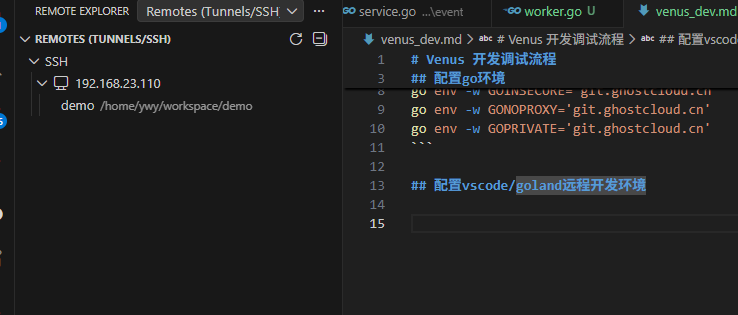
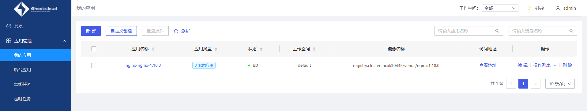
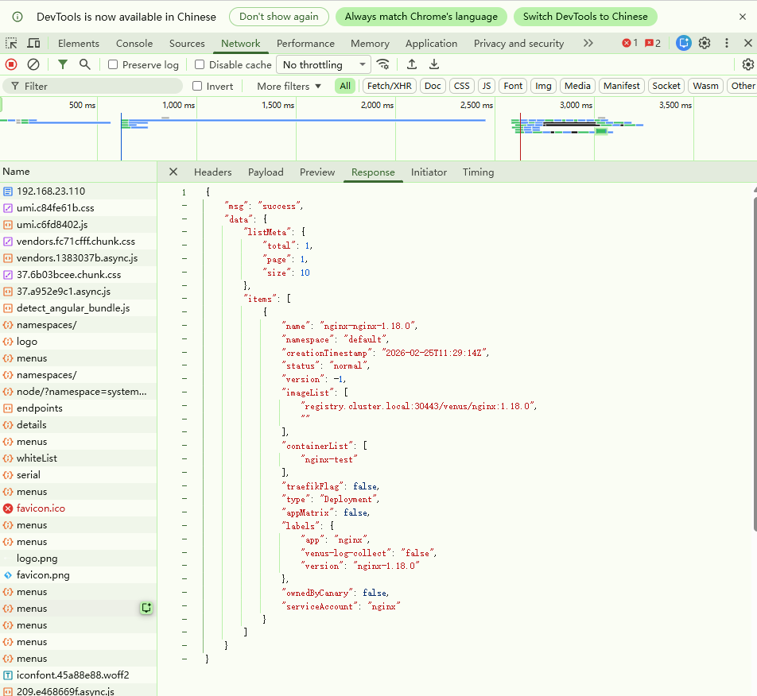

# Venus 开发调试流程  

## 配置go环境

```bash
go env -w GOPROXY=http://10.0.3.23:49171,direct
go env -w GONOSUMDB="*"
go env -w GOINSECURE='git.ghostcloud.cn'
go env -w GONOPROXY='git.ghostcloud.cn'
go env -w GOPRIVATE='git.ghostcloud.cn'
```

## 配置vscode/goland远程开发环境  



## 打包依赖

因为部分依赖无法在无网环境中下载，需要在有网环境中下载好，并打包然后传到开发机器上

有网环境的机器上执行：
```bash
tar -zcf C:\Users\y\Desktop\go-pkg-backup.tar.gz pkg
scp go-pkg-backup.tar.gz ywy@192.168.23.110:/home/ywy/workspace

```
开发机器上执行：  

```bash
cd /home/ywy/go
tar -xzf /home/ywy/workspace/go-pkg-backup.tar.gz
```

修改go环境为离线模式

```bash
go env -w GOSUMDB=off
```

## venus-plugin-app  

将venus-plugin-app 克隆下来

在venus中对应的管理界面如下：



带浏览器的dev模式，在network中可以看到请求：

```bash
curl 'https://192.168.23.110:30000/app/api/v1/apps?page=1&size=10&namespace=&filterBy=namespace%2C%2Cname%2C%2Cstatus%2C%2Ctype%2C' \
  -H 'Accept: application/json' \
  -H 'Accept-Language: zh-CN,zh;q=0.9,en;q=0.8' \
  -H 'Connection: keep-alive' \
  -H 'Content-Type: application/json; charset=utf-8' \
  -H 'Referer: https://192.168.23.110:30000/' \
  -H 'Sec-Fetch-Dest: empty' \
  -H 'Sec-Fetch-Mode: cors' \
  -H 'Sec-Fetch-Site: same-origin' \
  -H 'User-Agent: Mozilla/5.0 (Windows NT 10.0; Win64; x64) AppleWebKit/537.36 (KHTML, like Gecko) Chrome/145.0.0.0 Safari/537.36' \
  -H 'sec-ch-ua: "Not:A-Brand";v="99", "Google Chrome";v="145", "Chromium";v="145"' \
  -H 'sec-ch-ua-mobile: ?0' \
  -H 'sec-ch-ua-platform: "Windows"' \
  -H 'venus: eyJ0eXAiOiJKV1QiLCJhbGciOiJSUzI1NiIsImtpZCI6IkkySTI6VTcySjpXQVdDOjdMRVE6QkhaMzpKNUdSOkFSQ1I6Q0UyTTpSQktXOlkzQUM6QUpVUTpTV0tSIn0=.eyJpc3MiOiJ2ZW51cy10b2tlbi1pc3N1ZXIiLCJzdWIiOiJhZG1pbiIsImF1ZCI6WyIiXSwiZXhwIjoiMjAyNi0wMi0yNlQyNlQxMjozNDo1MCIsIm5vbmNlIjoiNVRJZ1AwU21pVThFVFRJcyIsInRlbmFudCI6IiIsImFjY291bnQiOiJhZG1pbiIsIm5hbWUiOiIifQ==.rW-HeIFx5deRW5r4Jls-_ZbdJHnjFoKfbR7SLksK71BgsHGkeskUm-PWmfAFjqky83NZAHAhfC91bFoFwBYCeTNVZf1uWopuNKXK6ZPIWOBdoDWMtf5NFX346evUtDQmJDd0UZWBE8EKVEQHc-AfXWwUd_FLdVZkomv4cT3In5I=' \
  --insecure
```

