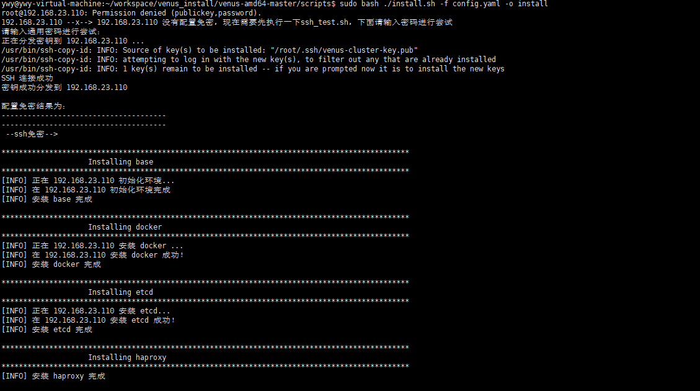
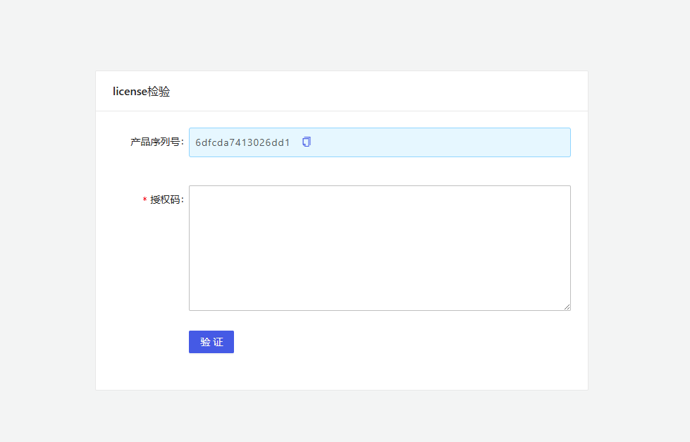
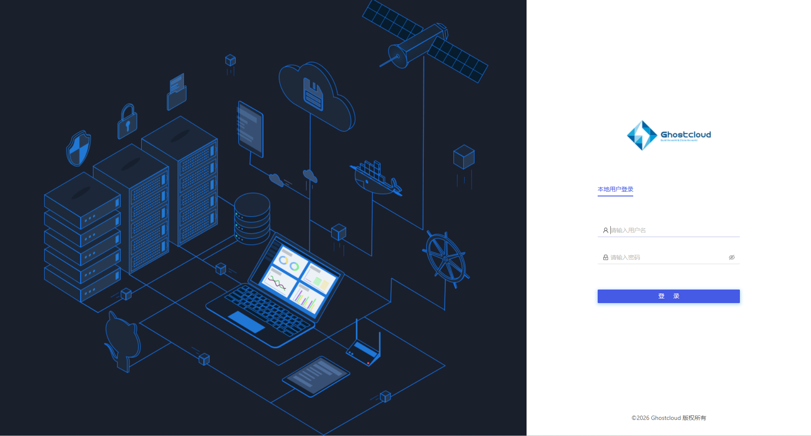
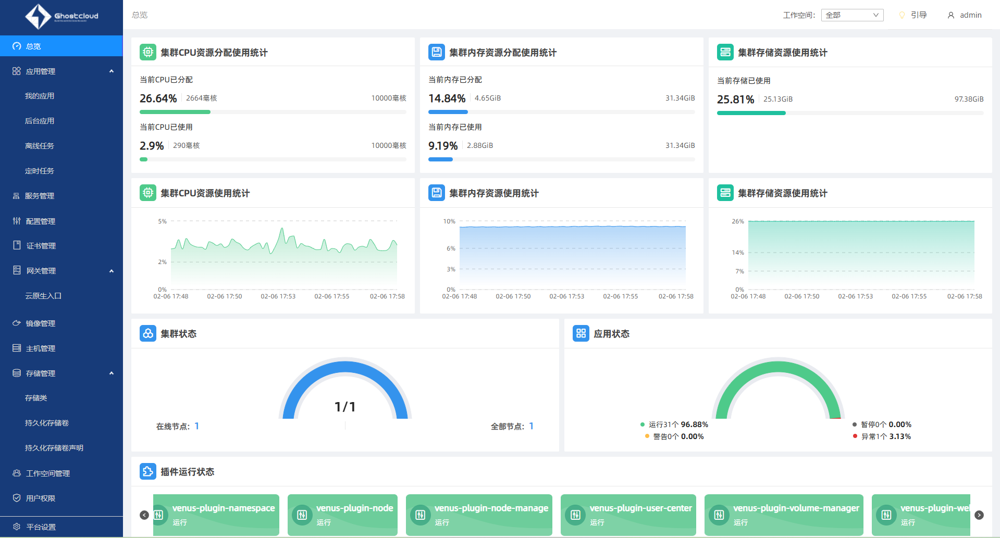

# Venus deploy


## 部署类型 

- 高可用部署：  
  - 管理节点：  
    1. 数量：3 个
    2. 配置：>=8 核 16G内存，磁盘越大越好

  - 工作节点：  
    1. 数量：N个（根据实际应用确认）
    2. 配置：>=8 核 16G内存

- 单机部署：  
  - 管理节点：  
    1. 数量：1 个
    2. 配置：>=16 核 32G内存

## 安装目标  

单节点部署、安装master节点（因为最近虚拟机资源紧张，暂时单节点部署）

## 环境准备  

虚拟机一台，操作系统为：ubuntu 20.04 x86_64  
配置：10核32G内存  
IP: 192.168.23.110
安装包：http://10.0.3.23:49173/Venus/releases/product/master/venus-amd64-master.tar.gz  

前置条件：  

- 需要开启root登录：  

```sh

# 修改 /etc/ssh/sshd_config
PermitRootLogin yes

```

- 重启ssh服务：  

```sh
sudo systemctl restart ssh
```

- 下载安装包并解压：  
  1. wget http://10.0.3.23:49173/Venus/releases/product/master/venus-amd64-master.tar.gz   
  2. tar zxvf venus-amd64-master.tar.gz


## 安装过程  

### 配置节点间的免密登录  

**重要：** 修改config.yaml中节点的ip信息

```sh
cd venus-amd64-master/scripts  
bash ./ssh_test.sh -f config.yaml -o install
```

输出如下：

```txt
解析出的IP如下：
192.168.23.110
请输入通用密码进行尝试：
正在分发密钥到 192.168.23.110 ...
/usr/bin/ssh-copy-id: INFO: Source of key(s) to be installed: "/home/ywy/.ssh/venus-cluster-key.pub"
/usr/bin/ssh-copy-id: INFO: attempting to log in with the new key(s), to filter out any that are already installed

/usr/bin/ssh-copy-id: WARNING: All keys were skipped because they already exist on the remote system.
		(if you think this is a mistake, you may want to use -f option)

SSH 连接成功
密钥成功分发到 192.168.23.110

正在分发密钥到 192.168.23.110 ...
/usr/bin/ssh-copy-id: INFO: Source of key(s) to be installed: "/home/ywy/.ssh/venus-cluster-key.pub"
/usr/bin/ssh-copy-id: INFO: attempting to log in with the new key(s), to filter out any that are already installed

/usr/bin/ssh-copy-id: WARNING: All keys were skipped because they already exist on the remote system.
		(if you think this is a mistake, you may want to use -f option)

SSH 连接成功
密钥成功分发到 192.168.23.110

配置免密结果为：
--------------------------------------
--------------------------------------
 --ssh免密--> 

```

### config.yaml  

真正开始安装之前需要仔细阅读这个配置文件，重点在于配置master节点核node节点信息。  
由于本次部署只部署master节点，所以config中只保留master节点信息即可。  

```yaml
# -------> 集群节点配置 <--------
# ---------> 必填参数 <---------
# 参数作用：集群master与node节点信息。  
# 重要提示：nodes若没有，可以删掉nodes参数，至少需要一个master节点信息。
masters:
  - name: master1
    ip: 192.168.23.110
```

### install 

- root 身份：  

```sh
bash ./install.sh -f config.yaml -o install
```

- 非 root 身份：  

```sh
sudo bash ./install.sh -f config.yaml -o install
```

安装过程中可能还会提示配置免密，根据提示输入密码即可。   

部分截图：  




当显示下图时：


安装完成， Congrats！！！

安装日志： /var/lib/ghostcloud/venus/install.log  

### 产品激活  

在浏览器中输入：https://192.168.23.110:30000/#/login  
产品ID： 6dfcda7413026dd1

会出现界面：  



### 下载并部署Harbor CA证书  

```sh
# 使用域名
curl http://registry.ghostcloud.cn:8080/registry.ghostcloud.cn.crt -o /etc/docker/certs.d/registry.ghostcloud.cn/ca.crt

# 使用IP
curl http://10.0.3.13:8080/registry.ghostcloud.cn.crt -o /etc/docker/certs.d/registry.ghostcloud.cn/ca.crt
```

### docker login  

```sh
# 使用域名

docker login registry.ghostcloud.cn -u hebo -p JLY123456

# 使用IP
docker login 10.0.3.13:8080 -u hebo -p JLY123456
```

### 生成授权码  

```sh
# 使用域名
docker pull registry.ghostcloud.cn/venus/venus-plugin-license-keygen:v4.8.0

# 使用IP
docker pull 10.0.3.13:8080/venus/venus-plugin-license-keygen:v4.8.0

docker run -idt --name venus-license-keygen -p 30010:8080  registry.ghostcloud.cn/venus/venus-plugin-license-keygen:v4.8.0


curl -H 'Content-Type: application/json' -d '{"product": {"finger_print": "6dfcda7413026dd1","name": "venus","version": "trial"},"user": {"common_name": "ghostcloud.cn","phone": "12345678901","company": "Ghostcloud Co.,Ltd","email": "develop@ghostcloud.cn","description": "trail license sign from Ghostcloud Co.,Ltd"},"grants": {"expire": "2092-01-01T00:00:00+08:00","node_limits": {"master": 10,"node": 50},"user_limit": 0,"resource_limit": {"cpu": "*","memory": "*","disk": "*"},"authorities": ["*:*:*"]}}' -X POST http://192.168.23.110:30010/v1/keygen

```

以上命令最终会返回：  

```json
{"message":"ok","data":"fec3615cd03b5ae3fecca162b0bc5336109567e9016b29bebfca8fde1e9fe3832c951b5090089900d5147347654c6bfce38f9c7e6e04865cbbcae6a73de67092de"}
```

其中data部分就是授权码

### 登录界面  



输入账密：admin/admin12345 进入引导页面  


